# Nok Nok FIDO Auth Node
The Nok Nok S3 Authentication Suite facilitates FIDO-certified multi-factor authentication (including FIDO UAF, WebAuthn, and FIDO2) for both mobile
and web applications. This eliminates the inconvenience of having to remember and type usernames and passwords by enabling users to leverage the cutting-edge biometric authentication technologies that their devices already possess.

This authentication node make it easy to integrate FIDO into your ForgeRock Access Manager (AM) implementation.

## About Nok Nok Labs
Nok Nok is the trusted leader in next-generation consumer authentication providing passwordless solutions to the world’s largest organizations. Delivering the most innovative authentication solutions in the market today, Nok Nok empowers global organizations to improve the user experience to access digital services, while meeting the most advanced privacy and regulatory requirements. The Nok Nok™ S3 Authentication Suite integrates into existing security environments to deliver a cost-effective, future-proof and standards-based authentication solution. As a founder of the FIDO Alliance and inventor of FIDO specifications, Nok Nok is the expert in deploying standards-based authentication.  For more information, visit www.noknok.com.

## Installation
The following are the installation steps:

**1.** Copy the `nnl-auth-nodes-<version>.jar` and `nnl-federation-common-<version>.jar` files, provided in the forgerock_bom zip, along with the external dependencies (except gwtutorial.war), into the directory where AM is currently deployed.
```bash
../$CATALINA_HOME/webapps/openam/WEB-INF/lib
```
**2.** Copy the `jwt_config.json` file (JSON Web Key Set for token validation) provided to the following directory 
```bash
../$CATALINA_HOME/webapps/openam/WEB-INF/classes/configurations/forgerock/SessionPlugin
```
**3.** Extract the nnlsigin.war file, provided in the Web App SDK, to the directory shown below.  
```bash
../$CATALINA_HOME/webapps/nnlsignin/
```
**4.** Copy the `jwt_config.json` file (JSON Web Key Set for token validation) provided to the following directory 
```bash
../$CATALINA_HOME/webapps/nnlsignin/WEB-INF/classes/configurations/forgerock/SessionPlugin
```
**5.** Update the API endpoints for the login page by editing the following file:
```json
nnlsignin/config/config.js
```
Then replace the content of the file with the following:

```javascript
var signinConfig = {
  "appsdk_version": "9.1.0",
  "version": "9.1.0",
  "tenant_id": "{{tenant}}",
  "amserver": document.location.origin,
  "apiserver": "https://cloud.noknok.com",
  "nnlappsdk_url": "${apiserver}/${tenant_id}/webapps/nnlappsdk-${appsdk_version}",
  "storage_endpoint": "${apiserver}/${tenant_id}/webapps/nnlgateway/storage",
  "reg_endpoint": "${apiserver}/${tenant_id}/webapps/nnlgateway/nnl/reg",
  "auth_endpoint": "${apiserver}/${tenant_id}/webapps/nnlgateway/nnl/auth"
}
```
Replace {{tenant}} with the tenant used at Nok Nok Server (e.g. default) or Nok Nok Cloud.

**6.** Extract the gwtutorial.war file, provided in the forgerock_bom zip, into the directory specified below.
```bash
../$CATALINA_HOME/webapps/gwtutorial/
```
**7.** Copy the `jwt_config.json` file (JSON Web Key Set for token validation) provided to the following directory 
```bash
../$CATALINA_HOME/webapps/gwtutorial/WEB-INF/classes/configurations/forgerock/SessionPlugin
```
**8.** Update the API endpoints for the login page by editing the following file:
```json
gwtutorial/config/config.js
```
Then replace the content of the file with the following:

```javascript
var nnlConfig = {
  "appsdk_version": "9.1.0",
  "version": "9.1.0",
  "tenant_id": "{{tenant}}",
  "amserver": document.location.origin,
  "apiserver": "https://cloud.noknok.com",
  "web_oob_url": "${amserver}/gwtutorial/oobrecv.html",
  "nnlappsdk_url": "${apiserver}/${tenant_id}/webapps/nnlappsdk-${appsdk_version}",
  "storage_endpoint": "${apiserver}/${tenant_id}/webapps/nnlgateway/storage",
  "reg_endpoint": "${apiserver}/${tenant_id}/webapps/nnlgateway/nnl/reg",
  "auth_endpoint": "${apiserver}/${tenant_id}/webapps/nnlgateway/nnl/auth",
  "login_url": "${amserver}/gwtutorial/login",
  "netverify_endpoint": "${amserver}/gwtutorial/nvinit"
}
```
Replace {{tenant}} with the tenant used at Nok Nok Server (e.g. default) or Nok Nok Cloud.


**9.** Restart the web container to pick up the new node. The custom node then appears in the **authentication trees menu**.

### External Dependencies

| Distribution Package | Description |
| ------ | ------ |
| log4j-slf4j-impl-2.19.0.jar | The Apache Log4j SLF4J API binding to Log4j 2 Core  |
| log4j-jcl-2.19.0.jar | The Apache Log4j Commons Logging Adapter |
| log4j-core-2.19.0.jar | The Apache Log4j Implementation |
| log4j-1.2-api-2.19.0.jar | The Apache Log4j dependency for 1.x Compatibility API |
| log4j-api-2.19.0.jar | The Apache Log4j API |
| gwtutorial.war | Tutorial WebApp client for LoginPage supporting FIDO Authentication |

## Configuration
To enable sign in using NNL authentication Node:

- From **Authentication → Trees menu**, create a new authentication tree e.g **NNLFIDOAuthTree**

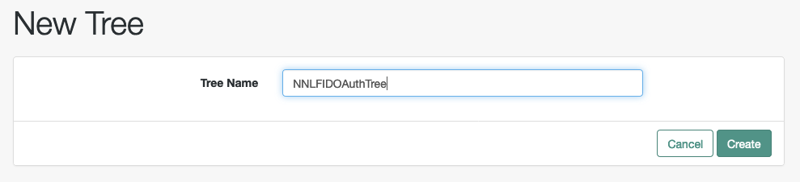

- The following is an example for the authentication tree using the **NNL Validator Node**. You can add your own or standard **username/password** authenticator nodes provided by AMServer for authentication using passwords.

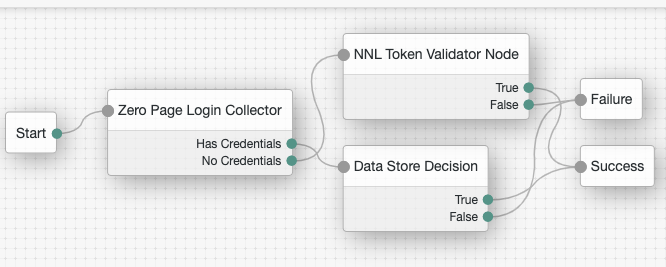

- Save the Tree after adding all the required nodes.

- Update the **Authentication → Settings** for using the **NNLFIDOAuthTree** tree to be the default for authentication flow.

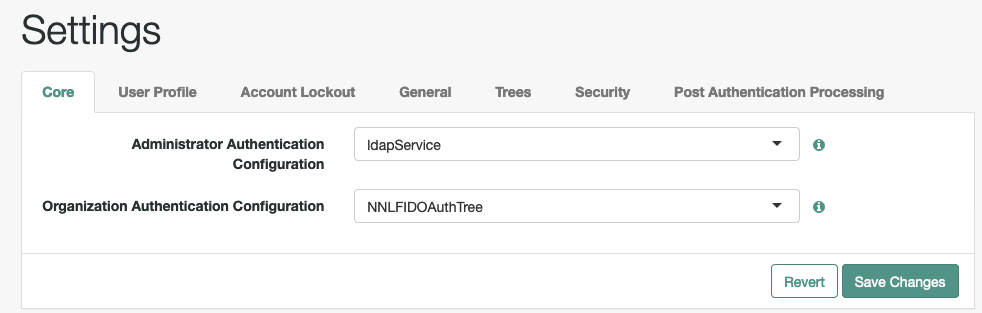

## NNL Token Validator Node
Once you install the jar file the NNL Token Validator Node is available in the tree designer pallet:

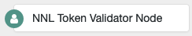

NNL Token Validator Node is a Tree Node that serves 2 purposes. 
- It acts as a redirection node to the Nok Nok Authentication client hosted with AM server. This NNL client enables FIDO certified multi-factor authentication (FIDO UAF, FIDO U2F, WebAuthn, and FIDO2) for web applications. 
- It validates the JWT Token received from the Nok Nok Authentication Server after successful user authentication using FIDO and generates user session information.

These are the Node Configuration Properties:  

- **Node Name:** name you choose for the node, e.g., NNL Token Validator Node
- **Authorization Cookie Name:** name of the authentication cookie which contains the JWT received from NNL Auth Server, e.g., Authorization
- **AM Endpoint:** URI to the AM endpoint of the hosted AM server, e.g., https://{{hostname}}/openam
- **Login Page Endpoint:** URI to the tutorial webapp login page hosted on the server, e.g., https://{{hostname}}/nnlsignin

Update the hostname in the settings to match your installation:

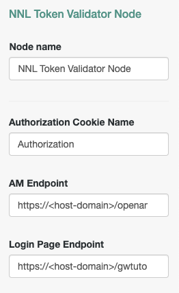

## Registration Flow
Before being able to use FIDO, you need to register a FIDO credential. To register a FIDO token, use the gwtutorial web application. Navigate to https://{{am-server-domain-and-port}}/**gwtutorial** in a WebAuthn capable browser.
The **nnlsignin** application also supports sugesting the User to register a FIDO credential upon successful sign in.
Also, ensure that you create the identical user in the Access Manager identity store.

**1.** Login using a username defined in your Access Manager identity store, e.g., "demo", and hardcoded password "noknok".

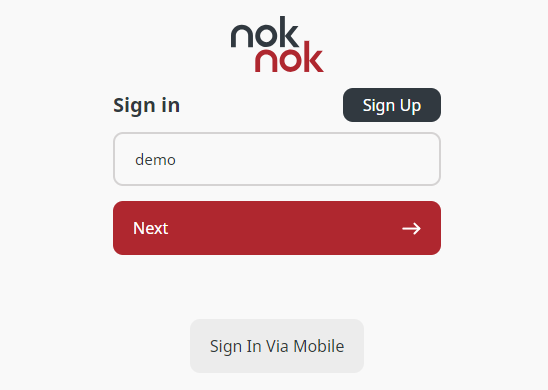

**2.** Click on the FIDO Auth button. This will trigger a WebAuthn registration. Follow the registration instructions.

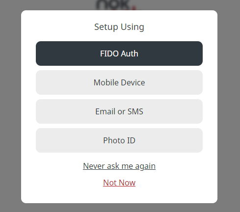

**3.** You will see the new registration listed.

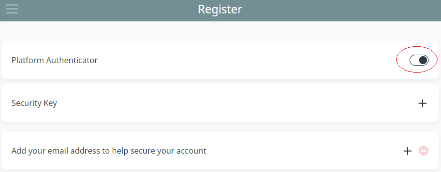

**4.** Now click the top left menu and then pick logout.

## Authentication Flow

You can test the authentication flow using the Access Manager console.

**1.** Navigate to your Access Manager console, e.g., https://{{am-server-domain-and-port}}/openam.

**2.** The **NNL Token Validator Node** redirects to the NNL Authentication Client's *Sign-In* page hosted on your Access Manager server.


**3.** User can sign in using **FIDO2**.

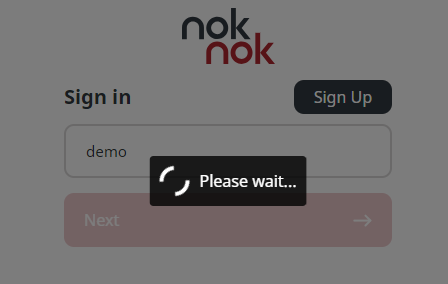

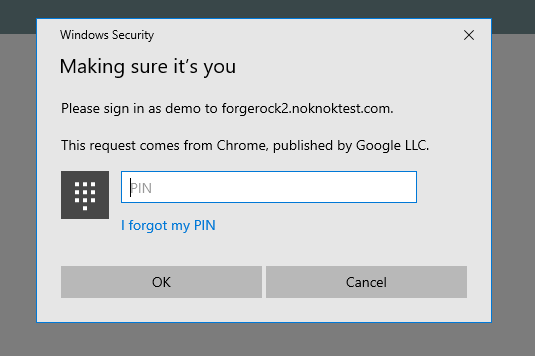

**4.** After successful authentication User is redirected to the **consent page** on the Access Manager console.

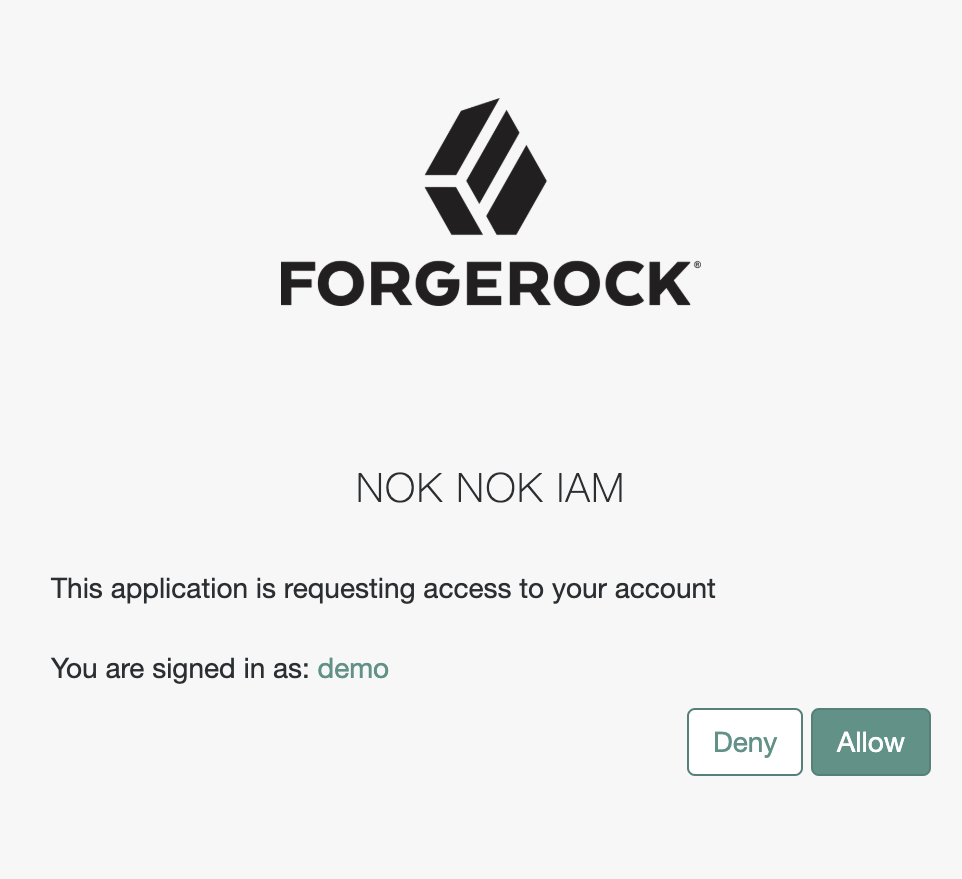

**5.** Once User consent, the browser is redirected to Access Manager console and the user is logged in.

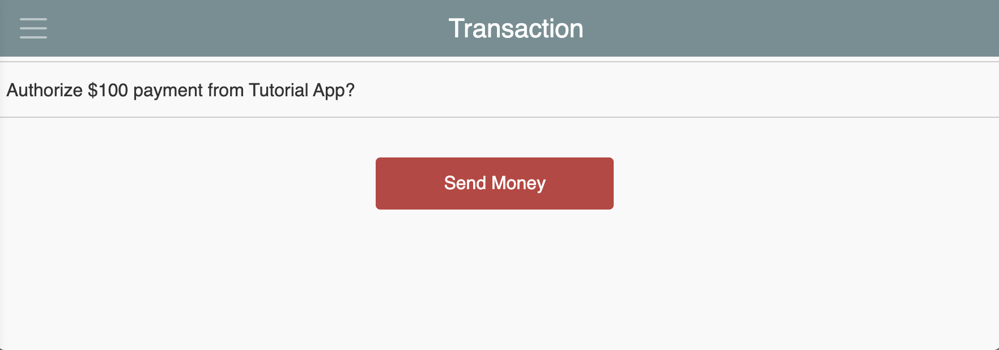

# Support
For more information on this node or to request a demonstration, please contact: Frank Gasparovic - frank.gasparovic@forgerock.com or info@noknok.com